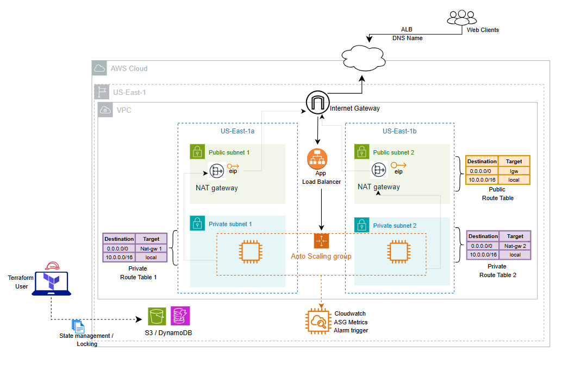

# Build a Scalable Web Application with Auto Scaling Group and Elastic Load Balancer on AWS

## Project Design



## Usage - Sample tfvars

```bash
######################## VPC ######################################
cidr_block = "10.0.0.0/16"
egress = [{
  from_port   = 0
  to_port     = 0
  protocol    = "-1"
  cidr_blocks = ["0.0.0.0/0"]
}]

ingress = [{
  from_port = 80
  to_port   = 80
  protocol  = "tcp"
}]
enable_dns_hostnames = true
enable_dns_support   = true


################################# ELB ##################################
name     = "Dev-Elb"
internal = false
listener = [{
  lb_port     = 80
  lb_protocol = "HTTP"
}]

target_grp = [{
  instance_port     = 80
  instance_protocol = "HTTP"
}]
enable_deletion_protection = false
load_balancer_type         = "application"


######################### Auto Scaling Group ##########################
min_size          = 1
max_size          = 3
desired_capacity  = 2
health_check_type = "ELB"
instance_type     = "t2.micro"

```

## Deploy

1. Navigate to the `backend-launch` directory and run the following commands to initialize and deploy the backend resources (S3 and DynamoDB):
   ```bash
   terraform init
   terraform apply
   ```
2. Navigate to the `envs/dev` directory and execute the following commands:
    ```bash
    terraform init
    terraform plan -var-file={name}.tfvars
    terraform apply -var-file={name}.tfvars
    ```

## Destroy
```bash
    terraform destroy -var-file={name}.tfvars
```